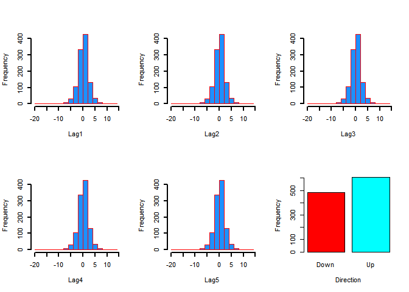
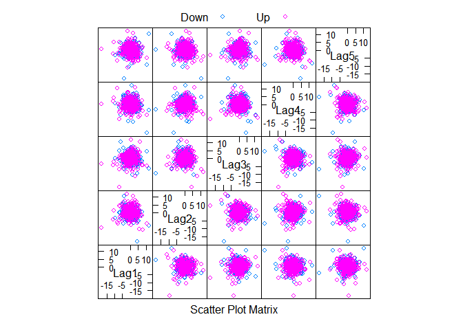
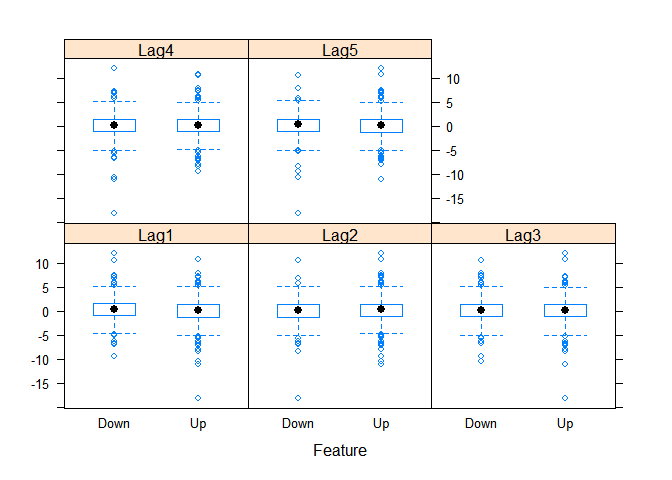
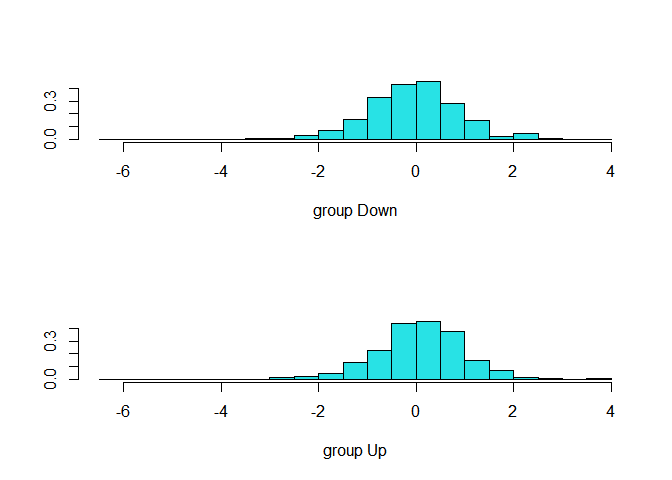
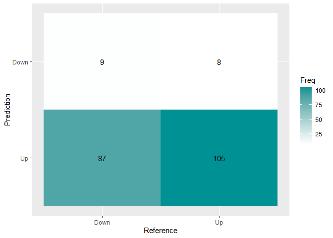
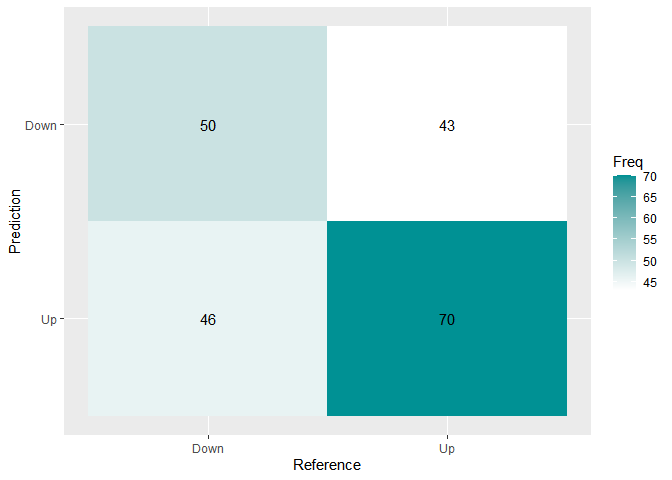
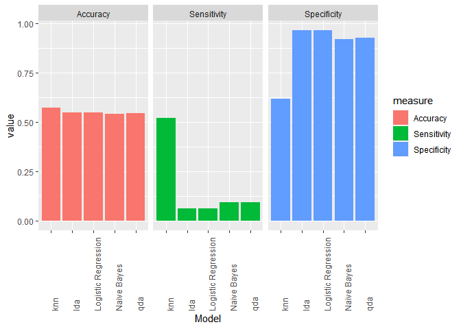

classification
================
2023-06-05

``` r
library(ISLR2)
library(ggplot2)
library(lattice)
library(caret)
library(MASS)
library(e1071)
library(class)
library(tidyverse)
```

\##checking data structure and visualization

``` r
str(Weekly)
```

    ## 'data.frame':    1089 obs. of  9 variables:
    ##  $ Year     : num  1990 1990 1990 1990 1990 1990 1990 1990 1990 1990 ...
    ##  $ Lag1     : num  0.816 -0.27 -2.576 3.514 0.712 ...
    ##  $ Lag2     : num  1.572 0.816 -0.27 -2.576 3.514 ...
    ##  $ Lag3     : num  -3.936 1.572 0.816 -0.27 -2.576 ...
    ##  $ Lag4     : num  -0.229 -3.936 1.572 0.816 -0.27 ...
    ##  $ Lag5     : num  -3.484 -0.229 -3.936 1.572 0.816 ...
    ##  $ Volume   : num  0.155 0.149 0.16 0.162 0.154 ...
    ##  $ Today    : num  -0.27 -2.576 3.514 0.712 1.178 ...
    ##  $ Direction: Factor w/ 2 levels "Down","Up": 1 1 2 2 2 1 2 2 2 1 ...

``` r
names(Weekly)
```

    ## [1] "Year"      "Lag1"      "Lag2"      "Lag3"      "Lag4"      "Lag5"     
    ## [7] "Volume"    "Today"     "Direction"

``` r
head(Weekly)
```

    ##   Year   Lag1   Lag2   Lag3   Lag4   Lag5    Volume  Today Direction
    ## 1 1990  0.816  1.572 -3.936 -0.229 -3.484 0.1549760 -0.270      Down
    ## 2 1990 -0.270  0.816  1.572 -3.936 -0.229 0.1485740 -2.576      Down
    ## 3 1990 -2.576 -0.270  0.816  1.572 -3.936 0.1598375  3.514        Up
    ## 4 1990  3.514 -2.576 -0.270  0.816  1.572 0.1616300  0.712        Up
    ## 5 1990  0.712  3.514 -2.576 -0.270  0.816 0.1537280  1.178        Up
    ## 6 1990  1.178  0.712  3.514 -2.576 -0.270 0.1544440 -1.372      Down

``` r
dim(Weekly)
```

    ## [1] 1089    9

``` r
attach(Weekly)
apply(Weekly, 2, function(x) sum(is.na(x)))
```

    ##      Year      Lag1      Lag2      Lag3      Lag4      Lag5    Volume     Today 
    ##         0         0         0         0         0         0         0         0 
    ## Direction 
    ##         0

``` r
summary(Weekly[2:8])
```

    ##       Lag1               Lag2               Lag3               Lag4         
    ##  Min.   :-18.1950   Min.   :-18.1950   Min.   :-18.1950   Min.   :-18.1950  
    ##  1st Qu.: -1.1540   1st Qu.: -1.1540   1st Qu.: -1.1580   1st Qu.: -1.1580  
    ##  Median :  0.2410   Median :  0.2410   Median :  0.2410   Median :  0.2380  
    ##  Mean   :  0.1506   Mean   :  0.1511   Mean   :  0.1472   Mean   :  0.1458  
    ##  3rd Qu.:  1.4050   3rd Qu.:  1.4090   3rd Qu.:  1.4090   3rd Qu.:  1.4090  
    ##  Max.   : 12.0260   Max.   : 12.0260   Max.   : 12.0260   Max.   : 12.0260  
    ##       Lag5              Volume            Today         
    ##  Min.   :-18.1950   Min.   :0.08747   Min.   :-18.1950  
    ##  1st Qu.: -1.1660   1st Qu.:0.33202   1st Qu.: -1.1540  
    ##  Median :  0.2340   Median :1.00268   Median :  0.2410  
    ##  Mean   :  0.1399   Mean   :1.57462   Mean   :  0.1499  
    ##  3rd Qu.:  1.4050   3rd Qu.:2.05373   3rd Qu.:  1.4050  
    ##  Max.   : 12.0260   Max.   :9.32821   Max.   : 12.0260

``` r
round(prop.table(table(Direction)), digit = 2)
```

    ## Direction
    ## Down   Up 
    ## 0.44 0.56

``` r
par(mfrow = c(2, 3))
  hist(Weekly[, 2], lwd = 2, col = "dodgerblue", border = "red", 
       xlab = "Lag1", main = "")

  hist(Weekly[, 3], lwd = 2, col = "dodgerblue", border = "red",
       xlab = "Lag2", main = "")
  
  hist(Weekly[, 4], lwd = 2, col = "dodgerblue", border = "red",
       xlab = "Lag3", main = "")
  
  hist(Weekly[, 5], lwd = 2, col = "dodgerblue", border = "red",
       xlab = "Lag4", main = "")
  
  hist(Weekly[, 6], lwd = 2, col = "dodgerblue", border = "red",
       xlab = "Lag5", main = "")
  
  barplot(table(Direction), col = rainbow(2), xlab = "Direction", 
          ylab = "Frequency") 
```

<!-- -->

``` r
par(mfrow = c(1, 1))
```

``` r
featurePlot(x = Weekly[, 2:6], y = Weekly$Direction, 
plot = "ellipse", auto.key = list(column = 2))
```

<!-- -->

``` r
featurePlot(x = Weekly[, 2:6], y = Weekly$Direction, 
plot = "boxplot", auto.key = list(column = 2))
```

<!-- -->

\##Fitting a logistic regression model

``` r
glm.fits <- glm(Direction ~ Lag1 + Lag2 + Lag3 + Lag4 + Lag5, 
                data = Weekly, family = binomial)
summary(glm.fits)
```

    ## 
    ## Call:
    ## glm(formula = Direction ~ Lag1 + Lag2 + Lag3 + Lag4 + Lag5, family = binomial, 
    ##     data = Weekly)
    ## 
    ## Deviance Residuals: 
    ##     Min       1Q   Median       3Q      Max  
    ## -1.7297  -1.2574   0.9939   1.0868   1.4671  
    ## 
    ## Coefficients:
    ##             Estimate Std. Error z value Pr(>|z|)    
    ## (Intercept)  0.23029    0.06203   3.712 0.000205 ***
    ## Lag1        -0.04010    0.02635  -1.522 0.128125    
    ## Lag2         0.06015    0.02674   2.249 0.024503 *  
    ## Lag3        -0.01508    0.02664  -0.566 0.571381    
    ## Lag4        -0.02677    0.02643  -1.013 0.311082    
    ## Lag5        -0.01349    0.02636  -0.512 0.608894    
    ## ---
    ## Signif. codes:  0 '***' 0.001 '**' 0.01 '*' 0.05 '.' 0.1 ' ' 1
    ## 
    ## (Dispersion parameter for binomial family taken to be 1)
    ## 
    ##     Null deviance: 1496.2  on 1088  degrees of freedom
    ## Residual deviance: 1486.7  on 1083  degrees of freedom
    ## AIC: 1498.7
    ## 
    ## Number of Fisher Scoring iterations: 4

\#Since Lag2 and Lag1 have the smallest p-value respectively, \#we
choose these two variables in order to predict Direction. \##Creating
test and train

``` r
Weekly_train <- (Year < 2007)
Weekly_test <- Weekly[!Weekly_train, ]
dim(Weekly_test)
```

    ## [1] 209   9

``` r
Direction_test <- Direction[!Weekly_train]
```

\##Fitting a logistic regression on train dataset

``` r
glm.fits <- glm(Direction ~ Lag1 + Lag2, data = Weekly, 
                family = binomial, subset = Weekly_train)
```

\##Making a prediction

``` r
glm.probs <- predict(glm.fits, Weekly_test, type = "response")
glm.pred <- rep("Down", 209)
glm.pred[glm.probs > 0.5] = "Up"
```

\#Confusion matrix

``` r
cm.glm <- confusionMatrix(factor(glm.pred), factor(Direction_test))
plt <- as.data.frame(cm.glm$table)
plt$Prediction <- factor(plt$Prediction, levels=rev(levels(plt$Prediction)))
ggplot(plt, aes(Reference ,Prediction, fill= Freq)) +
  geom_tile() + geom_text(aes(label=Freq)) +
  scale_fill_gradient(low="white", high="#009194") +
  labs(x = "Reference",y = "Prediction") +
  scale_x_discrete(labels=c("Down","Up")) +
  scale_y_discrete(labels=c("Up","Down"))
```

<!-- --> \####linear
discriminant analysis(lda) \#Fitting a LDA model

``` r
lda.fit <- lda(Direction ~ Lag1 + Lag2, data = Weekly,
               subset = Weekly_train)
plot(lda.fit)
```

<!-- --> \##making a
prediction

``` r
lda.pred <- predict(lda.fit, Weekly_test)
names(lda.pred)
```

    ## [1] "class"     "posterior" "x"

``` r
lda.class <- lda.pred$class
```

\#Confusion Matrix

``` r
cm.lda <- confusionMatrix(factor(lda.class), factor(Direction_test))
plt <- as.data.frame(cm.lda$table)
plt$Prediction <- factor(plt$Prediction, levels=rev(levels(plt$Prediction)))
ggplot(plt, aes(Reference, Prediction, fill= Freq)) +
  geom_tile() + geom_text(aes(label=Freq)) +
  scale_fill_gradient(low="white", high="#009194") +
  labs(x = "Reference",y = "Prediction") +
  scale_x_discrete(labels=c("Down","Up")) +
  scale_y_discrete(labels=c("Up","Down"))
```

<!-- --> \####Quadratic
discriminant analysis(qda) \#Fitting a QDA model

``` r
qda.fit <- qda(Direction ~ Lag1 + Lag2, data = Weekly, 
               family = binomial, subset = Weekly_train)
```

\#making prediction

``` r
qda.pred <- predict(qda.fit,  Weekly_test)
qda.class <- qda.pred$class
```

\#Confusion Matrix

``` r
cm.qda <- confusionMatrix(factor(qda.class), factor(Direction_test))
plt <- as.data.frame(cm.qda$table)
plt$Prediction <- factor(plt$Prediction, levels=rev(levels(plt$Prediction)))
ggplot(plt, aes(Reference, Prediction, fill= Freq)) +
  geom_tile() + geom_text(aes(label=Freq)) +
  scale_fill_gradient(low="white", high="#009194") +
  labs(x = "Reference",y = "Prediction") +
  scale_x_discrete(labels=c("Down","Up")) +
  scale_y_discrete(labels=c("Up","Down"))
```

<!-- --> \####Naive
Bayes(nb)

``` r
nb.fit <- naiveBayes(Direction ~ Lag1 + Lag2, data = Weekly, 
                     subset = Weekly_train)
mean(Lag1[Weekly_train][Direction[Weekly_train] == "Down"])
```

    ## [1] 0.2768222

``` r
sd(Lag1[Weekly_train][Direction[Weekly_train] == "Down"])
```

    ## [1] 1.987417

\##making prediction with nb model

``` r
nb.class <- predict(nb.fit, Weekly_test)
```

\#Confusion Matrix

``` r
cm.nb <- confusionMatrix(factor(nb.class), factor(Direction_test))
plt <- as.data.frame(cm.nb$table)
plt$Prediction <- factor(plt$Prediction, levels=rev(levels(plt$Prediction)))
ggplot(plt, aes(Reference, Prediction, fill= Freq)) +
  geom_tile() + geom_text(aes(label=Freq)) +
  scale_fill_gradient(low="white", high="#009194") +
  labs(x = "Reference",y = "Prediction") +
  scale_x_discrete(labels=c("Down","Up")) +
  scale_y_discrete(labels=c("Up","Down"))
```

<!-- --> \##Using
predict function in nb model to generate estimates of the \#-probability
that each observation belongs to a particular class.

``` r
nb.preds <- predict(nb.fit, Weekly_test, type = "raw")
nb.preds[1:5, ]
```

    ##           Down        Up
    ## [1,] 0.4957283 0.5042717
    ## [2,] 0.4819152 0.5180848
    ## [3,] 0.5047615 0.4952385
    ## [4,] 0.4646987 0.5353013
    ## [5,] 0.4886464 0.5113536

\####K-Nearest-Neighbors \##making train and test dataset

``` r
train.X <- cbind(Lag1, Lag2)[Weekly_train, ]
test.X <- cbind(Lag1, Lag2)[!Weekly_train, ]
train.Direction <- Direction[Weekly_train]
```

\##using knn on dataset with k =5

``` r
set.seed(1)
knn.pred <- knn(train.X, test.X, train.Direction, k = 5)
```

\#Confusion matrix

``` r
cm.knn <- confusionMatrix(factor(knn.pred), factor(Direction_test))
plt <- as.data.frame(cm.knn$table)
plt$Prediction <- factor(plt$Prediction, levels=rev(levels(plt$Prediction)))
ggplot(plt, aes(Reference, Prediction, fill= Freq)) +
  geom_tile() + geom_text(aes(label=Freq)) +
  scale_fill_gradient(low="white", high="#009194") +
  labs(x = "Reference",y = "Prediction") +
  scale_x_discrete(labels=c("Down","Up")) +
  scale_y_discrete(labels=c("Up","Down"))
```

<!-- -->

``` r
comp <- data.frame(Model = c("Logistic Regression", "lda", "qda", "Naive Bayes", "knn"),
Accuracy = c(cm.glm[[3]][1], cm.lda[[3]][1], cm.qda[[3]][1], 
cm.nb[[3]][1], cm.knn[[3]][1]), Sensitivity = 
c(cm.glm[[4]][1], cm.lda[[4]][1], cm.qda[[4]][1], cm.nb[[4]][1], cm.knn[[4]][1]), Specificity = 
c(cm.glm[[4]][2], cm.lda[[4]][2], cm.qda[[4]][2], 
cm.nb[[4]][2], cm.knn[[4]][2]))
comp
```

    ##                 Model  Accuracy Sensitivity Specificity
    ## 1 Logistic Regression 0.5502392   0.0625000   0.9646018
    ## 2                 lda 0.5502392   0.0625000   0.9646018
    ## 3                 qda 0.5454545   0.0937500   0.9292035
    ## 4         Naive Bayes 0.5406699   0.0937500   0.9203540
    ## 5                 knn 0.5741627   0.5208333   0.6194690

``` r
complong <- gather(comp, key = "measure", value = "value", c("Accuracy", "Sensitivity", "Specificity"))
```

``` r
complong %>% 
  ggplot(aes(x = Model, y = value, fill = measure)) +
    geom_bar(stat = 'identity')+
theme(axis.text.x = element_text(angle = 90,hjust =0 )) +
  facet_wrap(~ measure)
```

<!-- -->
